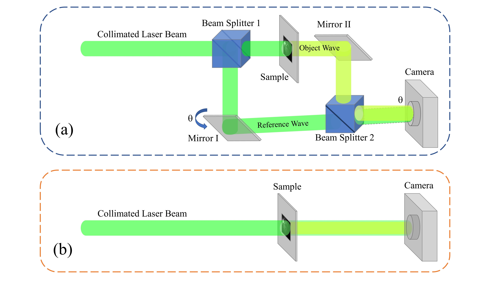
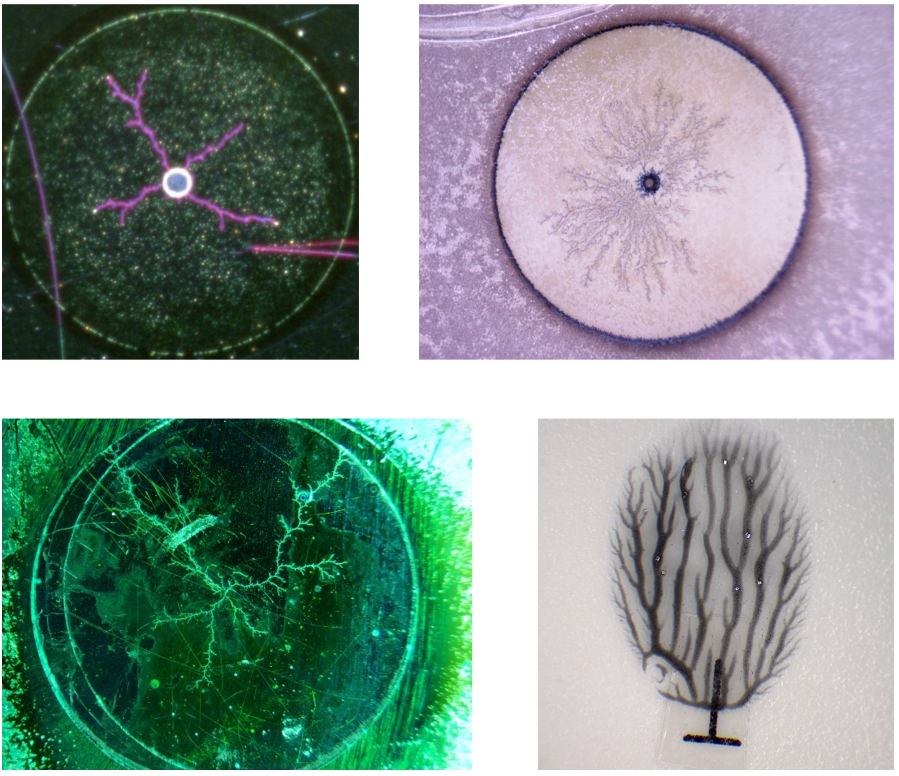
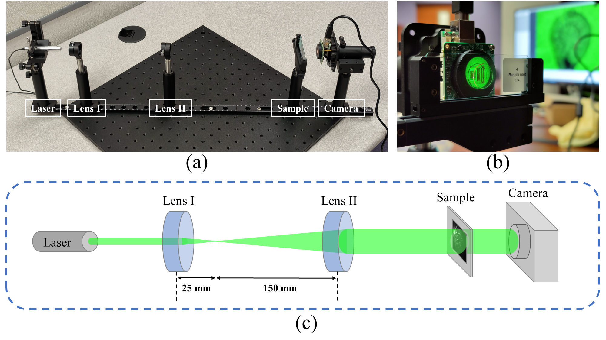
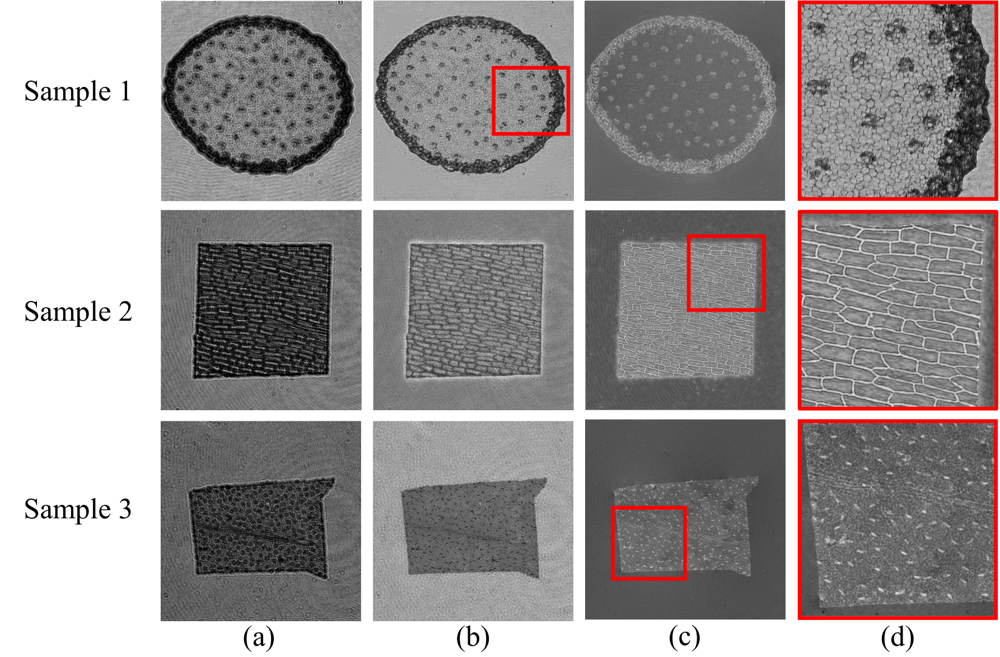
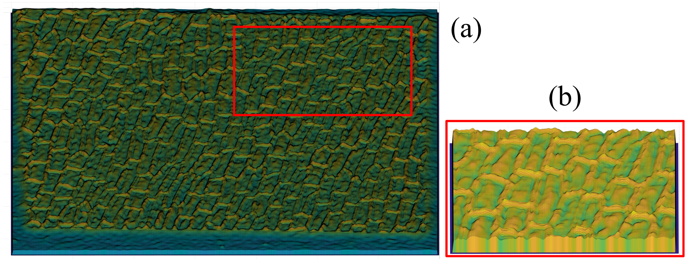
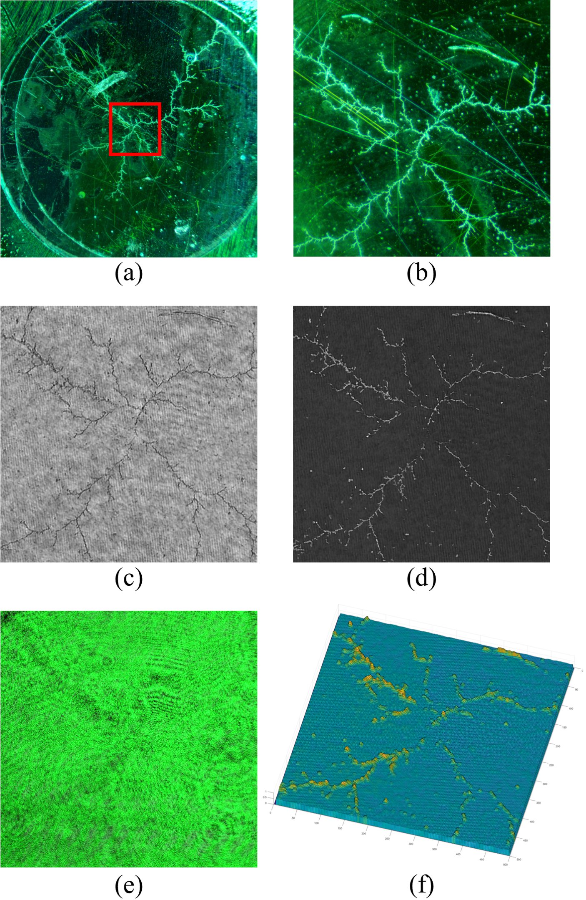
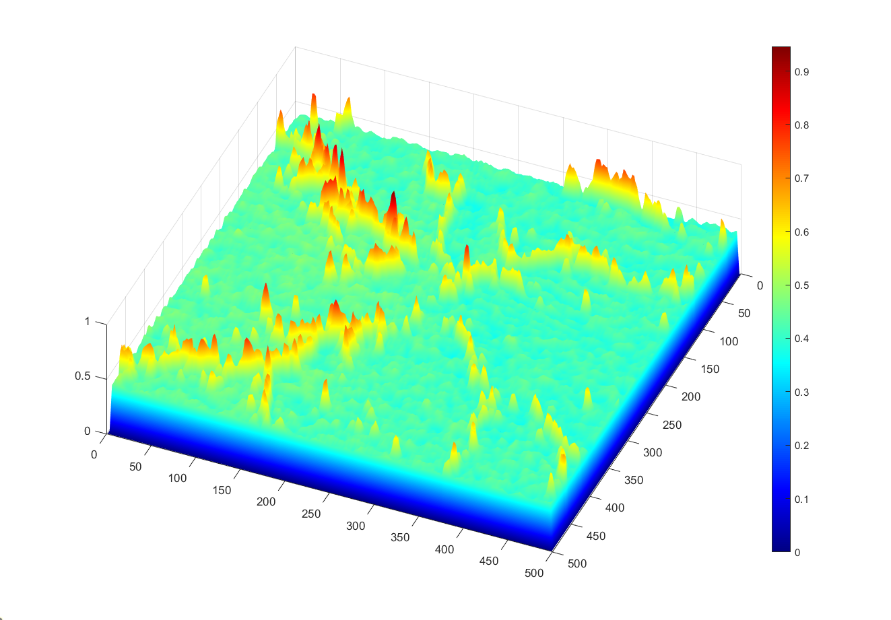
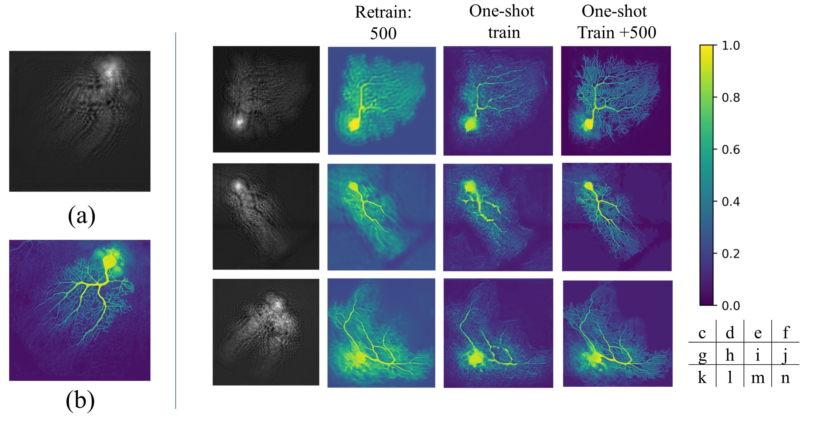

# DH-GAN: A Physics-driven Untrained Generative Adversarial Network for 3D Microscopic Imaging using Digital Holography

Digital holography (DH) is a 3D imaging technique by emitting a laser beam with a plane wavefront to an object and measuring the intensity of the diffracted waveform, called holograms. The object’s 3D shape can be obtained by numerical analysis of the captured holograms and recovering the incurred phase. 
Recently, deep learning (DL) methods have been used for more accurate holographic processing. However, most supervised methods require large datasets to train the model, which is rarely available in most DH applications due to the scarcity of samples or privacy concerns. 
A few one-shot DL-based recovery methods exist with no reliance on large datasets of paired images. Still, most of these methods often neglect the underlying physics law that governs wave propagation. These methods offer a black-box operation, which is not explainable, generalizable, and transferrable to other samples and applications.
In this work, we propose a new DL architecture based on generative adversarial networks that uses a discriminative network for realizing a semantic measure for reconstruction quality while using a generative network as a function approximator to model the inverse of hologram formation. We impose smoothness on the background part of the recovered image using a progressive masking module powered by simulated annealing to enhance the reconstruction quality. The proposed method is one of its kind that exhibits high transferability to similar samples, which facilitates its fast deployment in time-sensitive applications without the need for retraining the network. The results show a considerable improvement to competitor methods in reconstruction quality (about 5 dB PSNR gain) and robustness to noise (about 50% reduction in PSNR vs noise increase rate).

More information, please reference our paper on Arxiv:
<a href="https://arxiv.org/abs/2205.12920">DH-GAN: A Physics-driven Untrained Generative Adversarial Network for 3D Microscopic Imaging using Digital Holography</a>

## Dendrite Samples
In addition to simulated and public holograms, we use dendrite samples in our experiments. Dendrites are visual identifiers that are formed by growing tree-shaped metallic fractal patterns by inducing regulated voltage on electrolyte solutions with different propensities. These tags can be efficiently produced in large volumes on multiple substrate materials (e.g., mica, synthetic paper, etc.) with different granularity and density. 
Dendrites have specific features such as extremely high entropy for their inherent randomness, self-similarity, and unclonability due to their 3D facets and non-resolution granularity.
These features make this patented technology an appropriate choice for security solutions, including identification tags, visual authentication, random generators, and producing physical unclonable functions (PUFs) with robust security keys

## DH-GAN
Recently, deep learning (DL) methods have been used for DH, noting their superior performance in many visual computing and image processing tasks. In contrast to the conventional phase recovery algorithms that mainly rely on theoretical knowledge and phase propagation models, supervised DL methods often use large-scale datasets for training a black-box model to solve the inverse problem numerically. Therefore, prior knowledge about the propagation model and the system parameters is not necessary to construct DL networks.

The essence of our method relies on using a GAN-based architecture with several key modifications. Figure below present the details of the proposed DL
Architecture for DIH phase recovery. The loss term used in the generator network G_W includes the following components

## Experiment Setup
We use a digital camera A55050U and two convex lenses with focal lengths of f1 = 25 mm and f2 = 150 mm are applied to expand the laser beam, so that the laser beam fully covers the dendrite samples. A sample slide is placed on the sample holder; the laser beam passes through the sample, and propagates the hologram onto the sensor plane. The captured image is displayed on the computer in real-time and is fed to the proposed DL-based recovery algorithm. With an exposure time of 28 μs, the hologram is captured in clear and bright conditions. The DL framework is developed in Python environment using the Pytorch package and Adam optimizer. Training is performed using two Windows 10 machines with NVIDIA RTX2070 and RTX3090 graphics cards.

## Test Result 1 - Bio Samples
To prove the applicability of our model in real-world scenarios, we have tested different types of samples, including S1: Zea Stem, S2: Onion Epidermis, and S3: Stomata-Vicia Faba Leaf. The average cell sample size is 2 mm × 2 mm, equivalent to 1000 × 1000 pixels in the sensor field.
All samples have been placed at a distance of 5.5 mm (the closest possible) to the CMOS sensor to avoid unnecessary diffraction of the object waves. The parameters of the framework are set accordingly. For example, we set pixel size (2 μm), wavelength (0.532 nm), and the distance from sample to sensor (5,500 μm).

## Test Result 2 - Dendrite Samples

We also used the same setup to capture holographic readings of dendrite samples. The results are presented after convergence which occurs after 2,000 epochs. The results in Figs. 10 and 11 demonstrate the end-to-end performance of the proposed GAN-based phase recovery when applied to real holograms captured by our DIH setup.

## One-shot Training and Transfer Learning
A key challenge of DL-based phase recovery methods compared to conventional numerical methods is their generalizability and transferability to other experiments due to DL methods’ unexplainability and black-box nature. This matter can be problematic in real-time applications since the time-consuming training phase should be repeated for every new sample. The proposed method partially alleviates this issue due to incorporating the underlying physics laws.
To investigate the transferability of our method, we develop an experiment with the following three testing scenarios for simulated holograms for 4 randomly selected neuro samples taken from the CCBD dataset.

## Contributing
This project is contributed by: 
<a href="xiwenc@g.clemson.edu">Xiwen Chen</a>
<a href="hao9@g.clemson.edu">Hao Wang</a>
<a href="arazi@clemson.edu">Abolfazl Razi</a>

### Please cite our work if you think this project helps your research.
